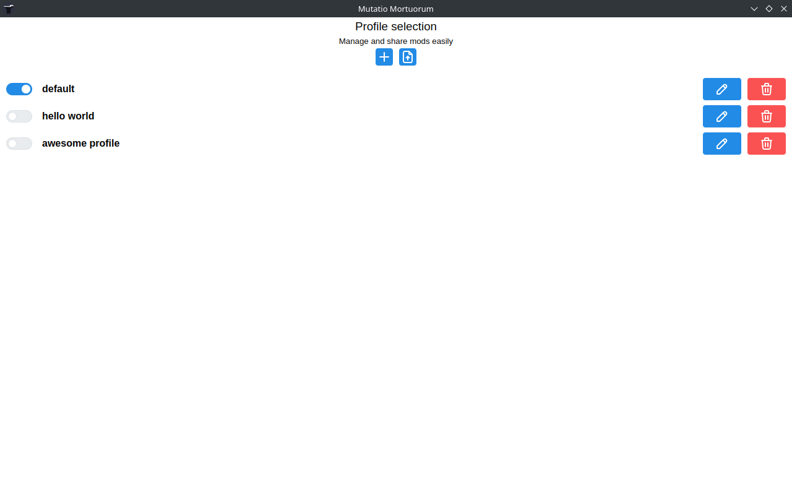
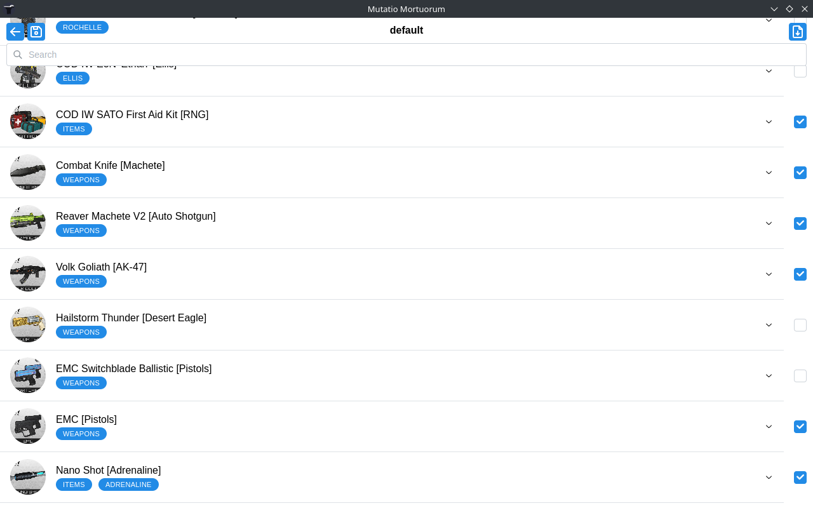

# Mutatio Mortuorum

Mutatio Mortuorum is a mod manager designed specifically for Left 4 Dead 2. Its goal is to make it easy to manage and organize your mods.

> [!NOTE]
> Mutatio Mortuorum is currently being worked on.
> While it should work well for most users, there are still bugs and missing features that need to be addressed.

## Features

- Mod profiles to switch between different sets of mods quickly and easily
- Export/import profiles to easily share your mods with friends
- Mods conflicts gestion directly with tags
- Filter and search mods from all steam subscribed mods
- Automatic imported profile mods subscription
- And more to come!

## Releases

> [!CAUTION]
> Mutatio Mortuorum is only supported on Windows 10 and later, and various Linux distributions.
> Installing it on unsupported systems may result in unexpected issues.

You can download the latest release from [GitHub Releases](https://github.com/Eduardo-Cerqueira/mutatio-mortuorum/releases)

## Screenshots

## Feedback and suggestions

If you have an idea or if you found a bug, please submit a GitHub issue so that i can track it. Please search the existing issues before submitting to prevent duplicates!

## Acknowledgments

- [xavier-cai/L4D2ModManager](https://github.com/xavier-cai/L4D2ModManager) Various concepts related to L4D2 mods
- [kingoftherats/node-vvpk](https://github.com/kingoftherats/node-vvpk) Read and Unpack VPK files
- [ceifa/steamworks.js](https://github.com/ceifa/steamworks.js/) Steamworks implementation

## License

Mutatio Mortuorum is Free Software: You can use, study share and improve it at your will. Specifically you can redistribute and/or modify it under the terms of the GNU General Public License version 3 as published by the Free Software Foundation.
